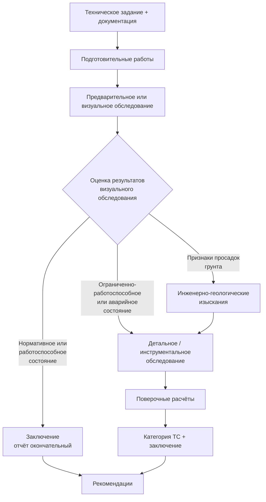

# Комплексное обследование зданий и сооружений

Процесс комплексного обследования технического состояния зданий и сооружений по [[ГОСТ 31937-2024]] (раздел 5) и [[СП 13-102-2003]] (разделы 4–8). Применимо к жилым, общественным и производственным зданиям/сооружениям, включая их системы инженерно-технического обеспечения.

**Уверенность:** high. **Обновлено:** 2026-05-22.

**Ограничения:**
- Не заменяет текст нормативных документов.
- Не распространяется на гидротехнические сооружения, магистральные трубопроводы, подземные сооружения метрополитена, мостовые сооружения (см. [[Обследование мостовых сооружений]]).
- Для зданий после пожара — см. [[Обследование после пожара]].

---

## 1. Входы процесса

До начала работ должны быть получены:

- **Техническое задание (ТЗ)** на обследование, утверждённое заказчиком и согласованное исполнителем (СП 13-102-2003, п. 6.5).
- **Проектная и исполнительная документация:** инвентаризационные поэтажные планы, техпаспорт, акты осмотров, отчёты предыдущих обследований, проектная документация, геоподоснова, материалы инженерно-геологических изысканий (ГОСТ 31937-2024, п. 5.1.7).
- **Документы о собственности** (для жилых помещений: план БТИ, экспликация, документ о собственности; для нежилых: праворазрешающие документы, разрешение муниципальных органов) (МРР 2.2.07-98, п. 2.1).
- **Согласованный протокол доступа** к обследуемым конструкциям (при необходимости).

Если проектная документация отсутствует — сплошное детальное обследование обязательно (ГОСТ 31937-2024, п. 4.8).

## 2. Ресурсы

### 2.1. Организация-исполнитель

- Наличие **государственной лицензии** на право проведения обследования (СП 13-102-2003, п. 4.1; МРР 2.2.07-98, п. 2.5).
- Оснащение необходимой приборной и инструментальной базой.
- Квалифицированные специалисты: по конструкциям, инженерным системам, микроклимату, пожарной безопасности (МДС 13-20.2004).
- При комплексном обследовании — формирование комплексной группы специалистов.

### 2.2. Средства измерений

Все применяемые приборы и инструмент должны быть **поверены** в установленном порядке (СП 13-102-2003, п. 8.2.2; ГОСТ 31937-2024, п. 5.1.16).

**Базовый набор:**
- Линейки, рулетки, штангенциркули, щупы, шаблоны, угломеры, уровни, отвесы — для обмерных работ.
- Нивелиры, теодолиты, дальномеры, лазерные сканеры — для геодезических измерений.

**Специализированные средства по задачам:**

| Задача | Средства |
|--------|----------|
| Прочность бетона (НК) | Молоток Физделя, молоток Кашкарова, пистолет ЦНИИСК (механические); прибор УКБ-1 и аналоги (ультразвук) — по ГОСТ 22690, ГОСТ 17624 |
| Армирование ЖБК | Магнитный метод (ГОСТ 22904), радиационный метод (ГОСТ 17625), прибор ИСМ, контрольное вскрытие |
| Прочность арматуры | Испытания на растяжение по ГОСТ 12004 (образцы, вырезанные из конструкций) |
| Качество сварных швов | УЗК по ГОСТ 23858, радиационный метод по ГОСТ 17625, визуальный осмотр |
| Химический состав стали | Фотоэлектрический спектральный (ГОСТ 18895), спектрографический (ГОСТ 27809), химический (ГОСТ 22536.0) |
| Прочность камня/кирпича | Молоток Кашкарова, зубило (ориентировочная оценка по характеру следа), склерометры |
| Влажность, плотность бетона | По ГОСТ 12730.0–12730.5 |
| Морозостойкость бетона | По ГОСТ 10060.0–10060.4 |
| Тепловизионный контроль | По ГОСТ 26629-85 |
| Магнитная память металла | По ГОСТ Р ИСО 24497-1 |
| Фотограмметрия | Цифровые камеры, ПО для построения ортофотопланов |
| Лазерное сканирование | Наземные лазерные сканеры (НЛС) |

## 3. Процесс

Процесс состоит из трёх основных этапов (ГОСТ 31937-2024, п. 5.1.2). При комплексном обследовании дополнительно включаются обследование систем ИТО, теплотехнических и акустических свойств.

### 3.1. Подготовительные работы

**Цель:** сбор и анализ исходных данных, составление программы работ (ГОСТ 31937-2024, п. 5.1.6).

#### 3.1.1. Техническое задание (ТЗ)

ТЗ разрабатывается заказчиком или исполнителем по согласованию с заказчиком (СП 13-102-2003, п. 6.5). В ТЗ указываются:

- **Цель обследования:** определение категории ТС, оценка возможности реконструкции/перепланировки, выявление причин дефектов, установление пригодности к эксплуатации, расследование аварий.
- **Состав работ:** визуальное, инструментальное, поверочные расчёты, инженерно-геологические изыскания.
- **Границы обследования:** здание целиком, отдельные конструкции, часть здания.
- **Перечень конструкций и инженерных систем под обследование.**
- **Требования к отчёту:** состав разделов, форма заключения (по приложению А/Б ГОСТ 31937-2024), необходимость паспорта здания (приложение Е).
- **Сроки и этапность:** календарный план, промежуточные отчёты.
- **Условия доступа:** обеспечение подмостей, снятие отделки, вскрытия.

ТЗ считается неотъемлемой частью договора и должно быть подписано обеими сторонами до начала работ (МРР 2.2.07-98, п. 2.2).

#### 3.1.2. Сбор документации

Перечень исходной документации регламентирован ГОСТ 31937-2024 (п. 5.1.7):

| Вид документации | Конкретные документы |
|------------------|---------------------|
| Проектная | Архитектурно-строительные чертежи (КЖ, КМ, КД, АР), расчётные записки, спецификации материалов, проект организации строительства (ПОС), данные инженерных изысканий |
| Исполнительная | Акты освидетельствования скрытых работ, исполнительные схемы, сертификаты/паспорта на материалы и конструкции, акты приёмки в эксплуатацию, журналы производства работ (общий, арматурный, бетонный, сварочный) |
| Эксплуатационная | Технический паспорт БТИ, акты осмотров несущих конструкций, ведомости усиления/ремонта, журналы эксплуатации, журналы наблюдений за деформациями, акты проверок вентиляции, дымоходов, замеров сопротивления изоляции |
| Предыдущих обследований | Отчёты о ранее проведённых обследованиях (год, организация, методики, выводы), данные мониторинга |
| Геология и геодезия | Отчёт об инженерно-геологических изысканиях, геоподоснова (топографическая съёмка М 1:500), данные стационарных наблюдений за уровнями грунтовых вод |
| Правоустанавливающие | Свидетельство о собственности, договор аренды, разрешение на строительство/реконструкцию (при необходимости) |

При отсутствии проектной документации — сплошное детальное обследование обязательно (ГОСТ 31937-2024, п. 4.8). Фактические параметры устанавливаются по результатам обмерных работ.

#### 3.1.3. Состав программы работ

Программа работ разрабатывается на основе ТЗ и анализа собранной документации. Согласно ГОСТ 31937-2024 (п. 5.1.6) и МРР 2.2.07-98 (п. 2.3), программа должна включать:

1. **Наименование и адрес объекта**, краткая характеристика (год постройки, этажность, конструктивная схема, материал стен и перекрытий, функциональное назначение).
2. **Цель и задачи обследования** (в соответствии с ТЗ).
3. **Состав обследуемых конструкций и систем ИТО** с указанием объёмов по каждому элементу:
   - фундаменты (тип, глубина заложения, материал);
   - несущие стены, колонны, пилоны;
   - перекрытия и покрытия;
   - фермы, балки, связи;
   - лестничные марши и площадки;
   - кровля, парапеты, карнизы;
   - инженерные системы (отопление, водоснабжение, вентиляция, электроснабжение, пожарная сигнализация).
4. **Методы и объёмы инструментальных измерений** по каждому типу конструкций:
   - геодезические измерения (осадки, крены, прогибы);
   - прочность материалов (механические НК, УЗК, керны);
   - вскрытия (шурфы, зондажи перекрытий);
   - тепловизионный контроль;
   - определение коррозионного состояния.
5. **Количество и места отбора проб** (бетон, арматура, кирпич, раствор, металл, древесина).
6. **Необходимость поверочных расчётов** и перечень расчётных ситуаций.
7. **Календарный план** с этапами, составом группы и ответственными исполнителями.
8. **Требования к охране труда** при обследовании (работа на высоте, в подвалах, с электроинструментом).

Программа утверждается руководителем организации-исполнителя и согласовывается с заказчиком (МРР 2.2.07-98, п. 2.4).

#### 3.1.4. Организация доступа

До начала полевых работ решаются вопросы:

- Обеспечение доступа к подвальным и чердачным помещениям (ключи, допуски, освещение).
- Установка лесов, подмостей, вышек-тур для осмотра фасадов и кровли.
- Согласование вскрытия полов, стен, отделки (протокол с собственником/арендатором).
- Допуск к кровле (при необходимости — наряд-допуск для работ на высоте).
- Отключение сетей (электроснабжения, отопления) при вскрытии перекрытий.
- Согласование прохода на территорию с режимом ограниченного доступа (ОПО, военные объекты, режимные предприятия).

Документальное оформление: акт-допуск, протокол согласования вскрытий, приказ о назначении ответственного производителя работ (СП 13-102-2003, п. 6.4).

### 3.2. Предварительное (визуальное) обследование

**Цель:** предварительная оценка технического состояния по внешним признакам, определение необходимости детального обследования (ГОСТ 31937-2024, п. 5.1.9; СП 13-102-2003, п. 7.1).

#### 3.2.1. Маршрут осмотра и инструментарий

Осмотр выполняется сплошным методом по маршруту: подвал/техподполье → первый этаж → лестничная клетка → поэтажно → чердак → кровля → фасады (с земли и с подмостей). Для каждого участка заполняется ведомость дефектов.

**Инструментарий осмотрщика:**

| Инструмент | Назначение |
|------------|-----------|
| Бинокль (8–10×) | Осмотр фасадов и кровли с земли |
| Рулетка (5–50 м) | Линейные размеры, пролёты, шаги |
| Штангенциркуль | Ширина раскрытия трещин |
| Щуп наборный (0,1–1,0 мм) | Глубина трещин, состояние швов |
| Лупа (4–10×) | Детальный осмотр зон концентрации напряжений |
| Линейка металлическая 1 м | Поверочные обмеры |
| Уровень строительный 1–2 м | Отклонение от горизонтали |
| Отвес (5–10 м) | Отклонение от вертикали |
| Молоток (0,2–1,0 кг) | Простукивание (глухой звук — отслоения, пустоты) |
| Зубило | Оценка прочности кирпича/камня (глубина следа) |
| Фонарь (500+ лм) | Затемнённые участки (подвалы, чердаки) |
| Цифровая камера | Фотофиксация (с масштабной линейкой) |
| Термогигрометр | Температура и влажность воздуха в помещении |

В сложных условиях (высота > 5 м, ограниченный доступ) дополнительно: лазерный дальномер, угломер, тепловизор (для предварительного выявления участков увлажнения/промерзания).

#### 3.2.2. Состав осмотра по элементам здания

**Фундаменты и подвал:**
- Визуальный осмотр по периметру, вскрытие шурфами (при необходимости).
- Наличие трещин в стенах подвала, следы подмыва/вымывания грунта.
- Признаки капиллярного увлажнения, высолы на поверхности стен.
- Состояние гидроизоляции (отсутствие, разрушение).
- Деформации пола подвала (выпучивание, просадки).
- Уровень грунтовых вод в подвале (при наличии приямков/дренажа).

**Несущие стены и колонны:**
- Вертикальные и наклонные трещины (трассировка от фундамента до карниза).
- Трещины в местах опирания перемычек, балок, плит перекрытия.
- Отклонение от вертикали (замер отвесом — если более 1/200 высоты — детальное обследование).
- Разрушение защитного слоя, оголение арматуры (ЖБК).
- Выкрашивание кирпича/камня, глубина разрушения швов (каменные).
- Следы увлажнения, промерзания, высолов.
- Коррозия закладных деталей и выпусков арматуры.

**Перекрытия и покрытия:**
- Прогибы плит, балок (визуально + нивелир).
- Трещины в приопорных зонах и в середине пролёта.
- Состояние стыков плит (расхождение швов).
- Влажностные пятна на потолке (протечки кровли/вышележащих этажей).
- Звук при простукивании (отслоение стяжки, пустоты в замоноличивании).

**Кровля:**
- Целостность кровельного ковра, состояние парапетов, водоприёмных воронок.
- Участки застоя воды, вздутия, трещины покрытия.
- Состояние несущих конструкций (фермы, прогоны, стропила) — трещины, гниль, коррозия.

**Лестницы:**
- Состояние маршей и площадок (трещины, выбоины, истирание ступеней).
- Крепление косоуров к несущим стенам.
- Ограждения (деформации, коррозия, надёжность крепления).

#### 3.2.3. Дефекты — классификация и фиксация

Фиксируются по видам (ГОСТ 31937-2024, приложения В–Д; [[Классификатор дефектов 1993]]):

| Номер | Вид дефекта | Единица | Инструмент |
|-------|-------------|---------|------------|
| 1 | Трещины: ширина раскрытия | мм | Штангенциркуль, щуп, трещиномер |
| 2 | Трещины: глубина | мм | Щуп, УЗК |
| 3 | Трещины: протяжённость | м | Рулетка, линейка |
| 4 | Прогибы, выгибы | мм | Струна + линейка, нивелир |
| 5 | Уклон, отступ от вертикали | мм/м | Отвес, уровень, теодолит |
| 6 | Смещение опор/узлов | мм | Рулетка, теодолит |
| 7 | Разрушение защитного слоя | % площади | Визуально, замер площади |
| 8 | Коррозия арматуры | % сечения | Штангенциркуль после вскрытия |
| 9 | Разрушение материала (сколы) | % площади | Визуально |
| 10 | Увлажнение | % влажности | Влагомер, тепловизор |
| 11 | Высолы | % площади | Визуально |
| 12 | Биопоражение | % площади | Визуально, простукивание |

Для каждого дефекта фиксируются: место (ось, этаж, элемент), описание, численный параметр, фото с масштабом, и (при необходимости) предварительная причина.

#### 3.2.4. Оценка и выходные документы

По результатам осмотра:

1. **Схемы дефектов** (на поэтажных планах и разрезах): каждый дефект наносится условным обозначением с номером по ведомости.
2. **Ведомость дефектов и повреждений** в табличной форме с колонками: №, элемент, описание, количественная характеристика, эскиз/фото, предварительная причина.
3. **Предварительная категория ТС** — по шкале ГОСТ 31937-2024 (нормативное, работоспособное, ограниченно-работоспособное, аварийное) либо по пятиуровневой шкале при экспресс-оценке (см. [[Экспресс-обследование по внешним признакам]]).
4. **Вывод о необходимости детального обследования** с обоснованием.

Если визуального осмотра достаточно для категории «нормативное» или «работоспособное» — допускается завершить обследование и выдать отчёт по результатам визуального осмотра (ГОСТ 31937-2024, п. 5.1.11). Иначе — переход к детальному инструментальному обследованию.

### 3.3. Ветвление: детальное обследование или нет

#### Если да — если по результатам визуального обследования:

**а) Установлено нормативное или работоспособное состояние** И картина дефектов позволяет выявить причины И достаточна для оценки — детальное обследование **допускается не проводить**. Отчёт по визуальному обследованию является окончательным (ГОСТ 31937-2024, п. 5.1.11).

**б) Выявлены дефекты, снижающие прочность, устойчивость и жёсткость** несущих конструкций (ограниченно-работоспособное состояние) — необходимо **детальное обследование** для оценки несущей способности (ГОСТ 31937-2024, п. 5.1.11; СП 13-102-2003, п. 7.5).

**в) Выявлено аварийное состояние** — детальное обследование проводят **при необходимости**. Немедленно:
   - запрет эксплуатации (ГОСТ 31937-2024, п. 4.5);
   - разработка и выполнение противоаварийных мероприятий (страховочные крепления, подпорки);
   - установление обязательного режима мониторинга;
   - уведомление заказчика и собственника (РД 153-34.1-21.326-2001, п. 2.4).

**г) Обнаружены трещины, перекосы, разломы стен, свидетельствующие о просадках грунтового основания** — детальное обследование **должно включать** инженерно-геологические изыскания (ГОСТ 31937-2024, п. 5.1.12).

### 3.4. Детальное (инструментальное) обследование

#### 3.4.1. Определение объёма

**Сплошное (полное)** — обязательно при (СП 13-102-2003, п. 8.1.1; ГОСТ 31937-2024, п. 5.1.14):
- отсутствии проектной документации;
- обнаружении дефектов, снижающих несущую способность;
- реконструкции здания с увеличением нагрузок (в т.ч. этажности);
- возобновлении строительства, прерванного на срок более 3 лет без консервации;
- неодинаковых свойствах материалов в однотипных конструкциях.

**Выборочное** — при:
- необходимости обследования отдельных конструкций;
- потенциально опасных местах, где сплошное обследование невозможно.

**Правило сокращения объёма (СП 13-102-2003, п. 8.1.2):** если ≥20% однотипных конструкций (при общем количестве >20) в работоспособном состоянии, остальные допускается обследовать выборочно (не менее 10%, но не менее 3). Для фундаментов — не менее 30% каждого типа.

#### 3.4.2. Обмерные работы (СП 13-102-2003, п. 8.2)

**Цель:** уточнение фактических геометрических параметров, определение соответствия проекту.

**Общий порядок** (для всех конструкций):
1. Уточнение разбивочных осей, горизонтальных и вертикальных размеров.
2. Проверка пролётов и шага несущих конструкций.
3. Измерение основных геометрических параметров несущих конструкций.
4. Определение фактических размеров расчётных сечений и их соответствие проекту.
5. Определение форм и размеров узлов стыковых сопряжений.
6. Проверка вертикальности и соосности опорных конструкций.
7. Измерение прогибов, изгибов, отклонений от вертикали, наклонов, выпучиваний, перекосов, смещений и сдвигов.

**Точность измерений:**
- Линейные размеры пролётов, шагов — до 10 мм (5 мм — при расхождении с проектом < 5%).
- Сечения конструкций — до 1 мм (штангенциркуль) для металла; до 5 мм (рулетка) для ЖБ/камня.
- Отклонения от вертикали — до 1 мм на 1 м высоты (теодолит/отвес).
- Прогибы — до 1 мм (нивелир/струна).
- Ширина раскрытия трещин — до 0,05 мм (микроскоп МПБ-2, щуп).

**Специфика по материалу (СП 13-102-2003, п. 8.2.5–8.2.12):**

| Материал | Дополнительные измерения | Точность |
|----------|------------------------|----------|
| Железобетон | Наличие, расположение, количество и класс арматуры; признаки коррозии арматуры и закладных деталей; состояние защитного слоя (толщина, карбонизация); трещины и величина их раскрытия; участки отслоения бетона | Арматура — до 5 мм; защитный слой — до 1 мм (магнитный метод) |
| Камень | Трещины и величина их раскрытия; глубина выветривания швов; толщина и состав раствора; отклонение от вертикали стен и простенков | Трещины — до 0,1 мм (щуп); отклонение — до 2 мм на 1 м |
| Металл | Прямолинейность сжатых стержней; соединительные планки; элементы с резкими изменениями сечений; длина, катет и качество сварных швов; количество и диаметр заклёпок/болтов; фактическая толщина элементов (с учётом коррозионного износа); местные погибы, вмятины | Толщина — до 0,1 мм (штангенциркуль); катет шва — до 1 мм (шаблон сварщика) |
| Дерево | Искривления и коробление элементов; разрывы поперечных сечений; трещины по длине; участки биологического поражения (гниль, плесень, насекомые); глубина поражения щупом (зонд); влажность (электронный влагомер) | Влажность — до 1%; глубина поражения — до 1 мм; искривления — до 1 мм на 1 м |

**Методы обмеров** (выбор по доступности и требуемой точности):

| Метод | Точность | Применение |
|-------|----------|------------|
| Рулетка/линейка | ±5–10 мм | Габаритные размеры, пролёты, высота этажей |
| Лазерный дальномер | ±1–3 мм | Линейные размеры до 200 м, недоступные участки |
| Теодолит/тахеометр | ±1 мм на 1 м | Отклонение от вертикали, плановое положение |
| Нивелир | ±1 мм на 1 м | Прогибы, осадки, высотные отметки |
| Фотограмметрия | ±2–10 мм | Фасады, сложные поверхности, архитектурные элементы |
| Лазерное сканирование (НЛС) | ±1–5 мм | Полное 3D-облако точек здания, деформации, BIM |

**Результат:** планы с фактическим расположением конструкций (M 1:100–1:200), разрезы зданий, чертежи рабочих сечений (M 1:10–1:50), ведомости с отклонениями от проекта.

#### 3.4.3. Определение физико-механических характеристик материалов

**Бетон и железобетон** (см. [[Бетон - контроль прочности]]):
- Прочность бетона — механические методы НК (ГОСТ 22690), ультразвуковой метод (ГОСТ 17624), испытание кернов (ГОСТ 28570).
- **Число участков:** не менее 3 (зона/средняя прочность), 6 (средняя + коэффициент изменчивости), 9 (группа однотипных). Число однотипных конструкций — не менее 3 (СП 13-102-2003, п. 8.3.4).
- Плотность, влажность, водопоглощение — по ГОСТ 12730.0–12730.5.
- Морозостойкость — по ГОСТ 10060.0–10060.4.
- Армирование — магнитный метод (ГОСТ 22904), радиационный (ГОСТ 17625), контрольное вскрытие.
- Прочность арматуры — испытания по ГОСТ 12004 (не менее 3 стержней одного диаметра из однотипных конструкций).
- Для конструкций до 1986 г. — нормативные сопротивления по таблице В.2 приложения В СП 13-102-2003; после 1986 г. — по СНиП 2.03.01.

**Металлические конструкции** (см. [[Арматура и металл - контроль качества]]):
- Определение марки стали (химический/спектральный анализ по ГОСТ 22536.0, ГОСТ 18895, ГОСТ 27809).
- Механические свойства — по ГОСТ 1497 (образцы из проб, отобранных в местах с наименьшим напряжением).
- Отбор проб — по ГОСТ 7564 (единица проката → проба → заготовка → образец).
- Расчётные сопротивления: для конструкций до 1932 г. — γm=1,2; 1932–1982 — γm=1,1; после 1982 — по СНиП II-23 (СП 13-102-2003, п. 8.4.4).

**Каменные конструкции** (см. [[СП 15.13330.2020]]):
- Прочность камня/кирпича — по результатам испытания не менее 10 образцов.
- Прочность раствора — по отобранным образцам.
- Определение марки по прочности и морозостойкости.

**Древесина** (см. [[Древесина - методы испытаний]]):
- Влажность, прочность на сжатие/изгиб/скалывание.
- Выявление участков биопоражения (гниль, плесень, насекомые).

#### 3.4.4. Вскрытия и зондажи

**Шурфы** (для фундаментов):
- Количество — 2–3 на здание, под наружные и внутренние стены (МРР 2.2.07-98, п. 3.7–3.8).
- Глубина — ниже подошвы фундамента на 0,15 м (ГОСТ 31937-2024, п. 5.2.7).
- Длина обнажения — достаточная для оценки состояния.
- Расположение — при наличии трещин, выходящих на фундаменты, — обязательно; согласовывается с собственником и службами подземных сетей.
- Дополнительные шурфы — для определения границ аварийных/ограниченно-работоспособных фундаментов.

**Вскрытия перекрытий:**
- От 2 до 12 в зависимости от площади (МРР 2.2.07-98, табл. 5).

**Отбор проб материалов:**
- Бетон: не менее 5 кернов ∅10 см.
- Кирпич: не менее 10 шт.
- Бутовый камень: не менее 5 образцов.
- Арматура: не менее 3 стержней одного диаметра.

#### 3.4.5. Поверочные расчёты

Выполняются по результатам обследования с введением в расчёт (ГОСТ 31937-2024, п. 3.20):
- фактических геометрических параметров;
- фактической прочности материалов;
- действующих нагрузок (уточнённых);
- расчётной схемы с учётом имеющихся дефектов и повреждений.

Нормативная база для расчётов:

| Тип конструкций | Нормативный документ |
|-----------------|---------------------|
| Железобетонные | [[СП 63.13330.2018]] |
| Стальные | [[СП 16.13330.2017]] |
| Каменные и армокаменные | [[СП 15.13330.2020]] |
| Деревянные | [[СП 64.13330.2017]] |
| Основания | [[СП 22.13330.2016]] |
| Свайные фундаменты | [[СП 24.13330.2021]] |
| Надёжность и расчётные ситуации | [[ГОСТ 27751-2014]] |

### 3.5. Оценка категории технического состояния

Устанавливается одна из четырёх категорий по ГОСТ 31937-2024 (п. 4.5, 5.5):

**Нормативное** — количественные и качественные значения всех параметров соответствуют проекту и действующим нормам. Эксплуатация без ограничений.

**Работоспособное** — некоторые параметры не отвечают требованиям проекта/норм, но несущая способность и механическая безопасность обеспечиваются. Эксплуатация без ограничений.

**Ограниченно-работоспособное** — имеются дефекты/повреждения, приведшие к снижению несущей способности; опасность внезапного разрушения отсутствует. Необходим контроль (мониторинг) состояния и/или мероприятия по восстановлению/усилению.

**Аварийное** — несущая способность исчерпана, опасность обрушения. Эксплуатация не допускается. Обязательный режим мониторинга и противоаварийные мероприятия.

**Примечание:** В [[СП 13-102-2003]] — 5 категорий (исправное, работоспособное, ограниченно работоспособное, недопустимое, аварийное). В [[Экспресс-обследование по внешним признакам]] — 5-уровневая шкала (нормальное, удовлетворительное, не совсем удовлетворительное, неудовлетворительное, аварийное).

## 4. Выходы процесса

По итогам обследования составляется **заключение** (отчёт).

### 4.1. Состав заключения (по форме приложения А или Б ГОСТ 31937-2024)

Заключение включает (ГОСТ 31937-2024, п. 5.1.18):
- категорию технического состояния;
- материалы, обосновывающие принятую категорию;
- обоснование наиболее вероятных причин появления дефектов и повреждений;
- рекомендации по восстановлению или усилению конструкций (при необходимости);
- рекомендации по дальнейшей эксплуатации;
- срок очередного обследования.

### 4.2. Дополнительно при комплексном обследовании (ГОСТ 31937-2024, п. 5.1.20)

- Оценка состояния систем ИТО, средств связи.
- Теплотехнические и акустические показатели.
- Оценка шума, вибраций.
- Результаты, обосновывающие принятые оценки.

### 4.3. Паспорт здания/сооружения

При необходимости (если установлено ТЗ) составляется или уточняется паспорт здания (сооружения) по форме приложения Е ГОСТ 31937-2024 (п. 5.1.21).

## 5. Оценка успешности

Процесс считается успешно выполненным, если:
- установлена достоверная категория технического состояния всех обследованных конструкций;
- выявлены причины дефектов и повреждений;
- даны обоснованные рекомендации по дальнейшей эксплуатации, ремонту или усилению;
- установлен срок очередного обследования.

## 6. Действия при недостижении результатов

| Ситуация | Действие |
|----------|----------|
| Конструкция недоступна для обследования | Категория ТС не присваивается; в заключении указывается причина (ГОСТ 31937-2024, п. 5.1.18) |
| Результатов визуального обследования недостаточно | Переход к детальному инструментальному обследованию |
| Выявлено аварийное состояние | Немедленное уведомление заказчика, запрет эксплуатации, противоаварийные мероприятия, мониторинг |
| Обнаружены просадки грунта | Включение в программу инженерно-геологических изысканий |

## 7. Типовые подпроцессы (страницы для повторного использования)

Следующие процессы описаны на отдельных страницах и могут быть задействованы по мере необходимости:

- [[Экспресс-обследование по внешним признакам]] — предварительный этап, 5-уровневая шкала.
- [[Бетон - контроль прочности]] — методы и нормативы определения прочности бетона.
- [[Арматура и металл - контроль качества]] — испытания арматуры и стали.
- [[Древесина - методы испытаний]] — определение свойств древесины.
- [[Метрология и НК в обследовании]] — поверка приборов, методы неразрушающего контроля.
- [[Обследование после пожара]] — специфика для зданий после пожара.
- [[Мониторинг зданий и сооружений]] — система наблюдения при ограниченно-работоспособном и аварийном состоянии.
- [[Усиление и восстановление конструкций]] — следующий шаг после оценки.

## 8. Нормативная база

| Этап | Применимые документы |
|------|----------------------|
| Общие правила обследования | [[ГОСТ 31937-2024]], [[СП 13-102-2003]] |
| Инструментальные измерения | [[ГОСТ 24846-2019]] (деформации оснований), [[ГОСТ 26629-85]] (тепловизионный контроль), [[СП 126.13330.2017]] (геодезические работы) |
| Прочность бетона | ГОСТ 22690-2015, ГОСТ 17624-2012, ГОСТ 28570-90, ГОСТ 18105-2010 |
| Испытания арматуры | ГОСТ 12004-81, ГОСТ 30415-96 |
| Качество сварных швов | ГОСТ 23858-2019 (УЗК), ГОСТ 17625 (радиационный) |
| Испытания металла | ГОСТ 1497, ГОСТ 7564-97, ГОСТ 22536.0 |
| Поверочные расчёты | [[СП 63.13330.2018]], [[СП 16.13330.2017]], [[СП 15.13330.2020]], [[СП 64.13330.2017]], [[СП 22.13330.2016]], [[ГОСТ 27751-2014]] |
| После пожара | [[Обследование после пожара]] по СП 329.1325800.2017 |
| Промышленная безопасность | [[116-ФЗ]] (для ОПО), РД 153-34.1-21.326-2001 (для ТЭС) |
| Метрология | [[102-ФЗ]] (обеспечение единства измерений), [[ГОСТ Р 58938-2020]] (точность геометрических параметров) |

## 9. Развитие и источники

**Желательно добавить в `raw/`:**
- РД 22-01-97 «Требования к составу, порядку ведения и оформлению работ по обследованию технического состояния строительных конструкций зданий и сооружений» (отсутствует в хранилище).
- ВСН 57-88(р) «Положение по техническому обследованию жилых зданий» (есть, но с усечённым терминологическим разделом).
- ГОСТ Р 58945-2020 «Правила выполнения измерений параметров зданий и сооружений» (ссылается на терминологию ГОСТ Р 58938, но может содержать процедурные детали).
- Руководящие документы по обследованию для конкретных типов зданий (школы, больницы, объекты культурного наследия).

## Связи

- [[ГОСТ 31937-2024]]
- [[СП 13-102-2003]]
- [[Экспресс-обследование по внешним признакам]]
- [[Усиление и восстановление конструкций]]
- [[Мониторинг зданий и сооружений]]
- [[Обследование после пожара]]
- [[Обследование мостовых сооружений]]
- [[Бетон - контроль прочности]]
- [[Арматура и металл - контроль качества]]
- [[Древесина - методы испытаний]]
- [[Метрология и НК в обследовании]]
- [[biblio]]

## Источники

- [raw/ГОСТ 31937-2024](<../raw/Здания%20и%20сооружения.%20Правила%20обследования%20и%20мониторинга%20технического%20состояния.%20ГОСТ%2031937-2024%20%E2%80%94%20%D0%A0%D0%B5%D0%B4%D0%B0%D0%BA%D1%86%D0%B8%D1%8F%20%D0%BE%D1%82%2010.04.2024.md>)
- [raw/СП 13-102-2003](<../raw/Правила%20обследования%20несущих%20строительных%20конструкций%20зданий%20и%20сооружений.%20СП%2013-102-2003%20%E2%80%94%20%D0%A0%D0%B5%D0%B4%D0%B0%D0%BA%D1%86%D0%B8%D1%8F%20%D0%BE%D1%82%2021.08.2003.md>)
- [raw/МРР 2.2.07-98](<../raw/МРР%202.2.07-98%20Методика%20проведения%20обследований%20зданий%20и%20сооружений%20при%20их%20реконструкции%20и%20перепланировке.md>)
- [raw/МДС 13-20.2004](<../raw/МДС%2013-20.2004.md>)
- [raw/РД 153-34.1-21.326-2001](<../raw/РД%20153-34.1-21.326-2001%20«Методические%20указания%20по%20обследованию%20строительных%20конструкций%20производственных%20зданий%20и%20сооружений%20тепловых%20электростанций.%20Часть%201.%20Железобетонные%20и%20бетонные%20конструкции».md>)
- [raw/Пособие по обследованию строительных конструкций зданий](<../raw/Пособие%20по%20обследованию%20строительных%20конструкций%20зданий.md>)
- Дополнительные документы — см. [[biblio]]
