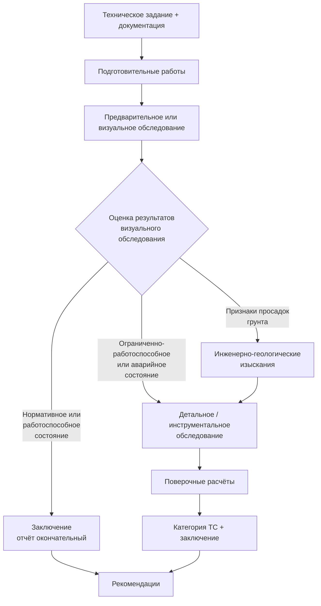

# Комплексное обследование зданий и сооружений

Процесс комплексного обследования технического состояния зданий и сооружений по [[ГОСТ 31937-2024]] (раздел 5) и [[СП 13-102-2003]] (разделы 4–8). Применимо к жилым, общественным и производственным зданиям/сооружениям, включая их системы инженерно-технического обеспечения.

**Уверенность:** high. **Обновлено:** 2026-05-22.

**Ограничения:**
- Не заменяет текст нормативных документов.
- Не распространяется на гидротехнические сооружения, магистральные трубопроводы, подземные сооружения метрополитена, мостовые сооружения (см. [[Обследование мостовых сооружений]]).
- Для зданий после пожара — см. [[Обследование после пожара]].

---

## 1. Входы процесса

До начала работ должны быть получены:

- **Техническое задание (ТЗ)** на обследование, утверждённое заказчиком и согласованное исполнителем (СП 13-102-2003, п. 6.5).
- **Проектная и исполнительная документация:** инвентаризационные поэтажные планы, техпаспорт, акты осмотров, отчёты предыдущих обследований, проектная документация, геоподоснова, материалы инженерно-геологических изысканий (ГОСТ 31937-2024, п. 5.1.7).
- **Документы о собственности** (для жилых помещений: план БТИ, экспликация, документ о собственности; для нежилых: праворазрешающие документы, разрешение муниципальных органов) (МРР 2.2.07-98, п. 2.1).
- **Согласованный протокол доступа** к обследуемым конструкциям (при необходимости).

Если проектная документация отсутствует — сплошное детальное обследование обязательно (ГОСТ 31937-2024, п. 4.8).

## 2. Ресурсы

### 2.1. Организация-исполнитель

- Наличие **государственной лицензии** на право проведения обследования (СП 13-102-2003, п. 4.1; МРР 2.2.07-98, п. 2.5).
- Оснащение необходимой приборной и инструментальной базой.
- Квалифицированные специалисты: по конструкциям, инженерным системам, микроклимату, пожарной безопасности (МДС 13-20.2004).
- При комплексном обследовании — формирование комплексной группы специалистов.

### 2.2. Средства измерений

Все применяемые приборы и инструмент должны быть **поверены** в установленном порядке (СП 13-102-2003, п. 8.2.2; ГОСТ 31937-2024, п. 5.1.16).

**Базовый набор:**
- Линейки, рулетки, штангенциркули, щупы, шаблоны, угломеры, уровни, отвесы — для обмерных работ.
- Нивелиры, теодолиты, дальномеры, лазерные сканеры — для геодезических измерений.

**Специализированные средства по задачам:**

| Задача | Средства |
|--------|----------|
| Прочность бетона (НК) | Молоток Физделя, молоток Кашкарова, пистолет ЦНИИСК (механические); прибор УКБ-1 и аналоги (ультразвук) — по ГОСТ 22690, ГОСТ 17624 |
| Армирование ЖБК | Магнитный метод (ГОСТ 22904), радиационный метод (ГОСТ 17625), прибор ИСМ, контрольное вскрытие |
| Прочность арматуры | Испытания на растяжение по ГОСТ 12004 (образцы, вырезанные из конструкций) |
| Качество сварных швов | УЗК по ГОСТ 23858, радиационный метод по ГОСТ 17625, визуальный осмотр |
| Химический состав стали | Фотоэлектрический спектральный (ГОСТ 18895), спектрографический (ГОСТ 27809), химический (ГОСТ 22536.0) |
| Прочность камня/кирпича | Молоток Кашкарова, зубило (ориентировочная оценка по характеру следа), склерометры |
| Влажность, плотность бетона | По ГОСТ 12730.0–12730.5 |
| Морозостойкость бетона | По ГОСТ 10060.0–10060.4 |
| Тепловизионный контроль | По ГОСТ 26629-85 |
| Магнитная память металла | По ГОСТ Р ИСО 24497-1 |
| Фотограмметрия | Цифровые камеры, ПО для построения ортофотопланов |
| Лазерное сканирование | Наземные лазерные сканеры (НЛС) |

## 3. Процесс

Процесс состоит из трёх основных этапов (ГОСТ 31937-2024, п. 5.1.2). При комплексном обследовании дополнительно включаются обследование систем ИТО, теплотехнических и акустических свойств.

### 3.1. Подготовительные работы

**Цель:** сбор и анализ исходных данных, составление программы работ (ГОСТ 31937-2024, п. 5.1.6).

#### 3.1.1. Техническое задание (ТЗ)

ТЗ разрабатывается заказчиком или исполнителем по согласованию с заказчиком (СП 13-102-2003, п. 6.5). В ТЗ указываются:

- **Цель обследования:** определение категории ТС, оценка возможности реконструкции/перепланировки, выявление причин дефектов, установление пригодности к эксплуатации, расследование аварий.
- **Состав работ:** визуальное, инструментальное, поверочные расчёты, инженерно-геологические изыскания.
- **Границы обследования:** здание целиком, отдельные конструкции, часть здания.
- **Перечень конструкций и инженерных систем под обследование.**
- **Требования к отчёту:** состав разделов, форма заключения (по приложению А/Б ГОСТ 31937-2024), необходимость паспорта здания (приложение Е).
- **Сроки и этапность:** календарный план, промежуточные отчёты.
- **Условия доступа:** обеспечение подмостей, снятие отделки, вскрытия.

ТЗ считается неотъемлемой частью договора и должно быть подписано обеими сторонами до начала работ (МРР 2.2.07-98, п. 2.2).

#### 3.1.2. Сбор документации

Перечень исходной документации регламентирован ГОСТ 31937-2024 (п. 5.1.7):

| Вид документации | Конкретные документы |
|------------------|---------------------|
| Проектная | Архитектурно-строительные чертежи (КЖ, КМ, КД, АР), расчётные записки, спецификации материалов, проект организации строительства (ПОС), данные инженерных изысканий |
| Исполнительная | Акты освидетельствования скрытых работ, исполнительные схемы, сертификаты/паспорта на материалы и конструкции, акты приёмки в эксплуатацию, журналы производства работ (общий, арматурный, бетонный, сварочный) |
| Эксплуатационная | Технический паспорт БТИ, акты осмотров несущих конструкций, ведомости усиления/ремонта, журналы эксплуатации, журналы наблюдений за деформациями, акты проверок вентиляции, дымоходов, замеров сопротивления изоляции |
| Предыдущих обследований | Отчёты о ранее проведённых обследованиях (год, организация, методики, выводы), данные мониторинга |
| Геология и геодезия | Отчёт об инженерно-геологических изысканиях, геоподоснова (топографическая съёмка М 1:500), данные стационарных наблюдений за уровнями грунтовых вод |
| Правоустанавливающие | Свидетельство о собственности, договор аренды, разрешение на строительство/реконструкцию (при необходимости) |

При отсутствии проектной документации — сплошное детальное обследование обязательно (ГОСТ 31937-2024, п. 4.8). Фактические параметры устанавливаются по результатам обмерных работ.

#### 3.1.3. Состав программы работ

Программа работ разрабатывается на основе ТЗ и анализа собранной документации. Согласно ГОСТ 31937-2024 (п. 5.1.6) и МРР 2.2.07-98 (п. 2.3), программа должна включать:

1. **Наименование и адрес объекта**, краткая характеристика (год постройки, этажность, конструктивная схема, материал стен и перекрытий, функциональное назначение).
2. **Цель и задачи обследования** (в соответствии с ТЗ).
3. **Состав обследуемых конструкций и систем ИТО** с указанием объёмов по каждому элементу:
   - фундаменты (тип, глубина заложения, материал);
   - несущие стены, колонны, пилоны;
   - перекрытия и покрытия;
   - фермы, балки, связи;
   - лестничные марши и площадки;
   - кровля, парапеты, карнизы;
   - инженерные системы (отопление, водоснабжение, вентиляция, электроснабжение, пожарная сигнализация).
4. **Методы и объёмы инструментальных измерений** по каждому типу конструкций:
   - геодезические измерения (осадки, крены, прогибы);
   - прочность материалов (механические НК, УЗК, керны);
   - вскрытия (шурфы, зондажи перекрытий);
   - тепловизионный контроль;
   - определение коррозионного состояния.
5. **Количество и места отбора проб** (бетон, арматура, кирпич, раствор, металл, древесина).
6. **Необходимость поверочных расчётов** и перечень расчётных ситуаций.
7. **Календарный план** с этапами, составом группы и ответственными исполнителями.
8. **Требования к охране труда** при обследовании (работа на высоте, в подвалах, с электроинструментом).

Программа утверждается руководителем организации-исполнителя и согласовывается с заказчиком (МРР 2.2.07-98, п. 2.4).

#### 3.1.4. Организация доступа

До начала полевых работ решаются вопросы:

- Обеспечение доступа к подвальным и чердачным помещениям (ключи, допуски, освещение).
- Установка лесов, подмостей, вышек-тур для осмотра фасадов и кровли.
- Согласование вскрытия полов, стен, отделки (протокол с собственником/арендатором).
- Допуск к кровле (при необходимости — наряд-допуск для работ на высоте).
- Отключение сетей (электроснабжения, отопления) при вскрытии перекрытий.
- Согласование прохода на территорию с режимом ограниченного доступа (ОПО, военные объекты, режимные предприятия).

Документальное оформление: акт-допуск, протокол согласования вскрытий, приказ о назначении ответственного производителя работ (СП 13-102-2003, п. 6.4).

### 3.2. Предварительное (визуальное) обследование

**Цель:** предварительная оценка технического состояния по внешним признакам, определение необходимости детального обследования (ГОСТ 31937-2024, п. 5.1.9; СП 13-102-2003, п. 7.1).

#### 3.2.1. Маршрут осмотра и инструментарий

Осмотр выполняется сплошным методом по маршруту: подвал/техподполье → первый этаж → лестничная клетка → поэтажно → чердак → кровля → фасады (с земли и с подмостей). Для каждого участка заполняется ведомость дефектов.

**Инструментарий осмотрщика:**

| Инструмент | Назначение |
|------------|-----------|
| Бинокль (8–10×) | Осмотр фасадов и кровли с земли |
| Рулетка (5–50 м) | Линейные размеры, пролёты, шаги |
| Штангенциркуль | Ширина раскрытия трещин |
| Щуп наборный (0,1–1,0 мм) | Глубина трещин, состояние швов |
| Лупа (4–10×) | Детальный осмотр зон концентрации напряжений |
| Линейка металлическая 1 м | Поверочные обмеры |
| Уровень строительный 1–2 м | Отклонение от горизонтали |
| Отвес (5–10 м) | Отклонение от вертикали |
| Молоток (0,2–1,0 кг) | Простукивание (глухой звук — отслоения, пустоты) |
| Зубило | Оценка прочности кирпича/камня (глубина следа) |
| Фонарь (500+ лм) | Затемнённые участки (подвалы, чердаки) |
| Цифровая камера | Фотофиксация (с масштабной линейкой) |
| Термогигрометр | Температура и влажность воздуха в помещении |

В сложных условиях (высота > 5 м, ограниченный доступ) дополнительно: лазерный дальномер, угломер, тепловизор (для предварительного выявления участков увлажнения/промерзания).

#### 3.2.2. Состав осмотра по элементам здания

**Фундаменты и подвал:**
- Визуальный осмотр по периметру, вскрытие шурфами (при необходимости).
- Наличие трещин в стенах подвала, следы подмыва/вымывания грунта.
- Признаки капиллярного увлажнения, высолы на поверхности стен.
- Состояние гидроизоляции (отсутствие, разрушение).
- Деформации пола подвала (выпучивание, просадки).
- Уровень грунтовых вод в подвале (при наличии приямков/дренажа).

**Несущие стены и колонны:**
- Вертикальные и наклонные трещины (трассировка от фундамента до карниза).
- Трещины в местах опирания перемычек, балок, плит перекрытия.
- Отклонение от вертикали (замер отвесом — если более 1/200 высоты — детальное обследование).
- Разрушение защитного слоя, оголение арматуры (ЖБК).
- Выкрашивание кирпича/камня, глубина разрушения швов (каменные).
- Следы увлажнения, промерзания, высолов.
- Коррозия закладных деталей и выпусков арматуры.

**Перекрытия и покрытия:**
- Прогибы плит, балок (визуально + нивелир).
- Трещины в приопорных зонах и в середине пролёта.
- Состояние стыков плит (расхождение швов).
- Влажностные пятна на потолке (протечки кровли/вышележащих этажей).
- Звук при простукивании (отслоение стяжки, пустоты в замоноличивании).

**Кровля:**
- Целостность кровельного ковра, состояние парапетов, водоприёмных воронок.
- Участки застоя воды, вздутия, трещины покрытия.
- Состояние несущих конструкций (фермы, прогоны, стропила) — трещины, гниль, коррозия.

**Лестницы:**
- Состояние маршей и площадок (трещины, выбоины, истирание ступеней).
- Крепление косоуров к несущим стенам.
- Ограждения (деформации, коррозия, надёжность крепления).

#### 3.2.3. Дефекты — классификация и фиксация

Фиксируются по видам (ГОСТ 31937-2024, приложения В–Д; [[Классификатор дефектов 1993]]):

| Номер | Вид дефекта | Единица | Инструмент |
|-------|-------------|---------|------------|
| 1 | Трещины: ширина раскрытия | мм | Штангенциркуль, щуп, трещиномер |
| 2 | Трещины: глубина | мм | Щуп, УЗК |
| 3 | Трещины: протяжённость | м | Рулетка, линейка |
| 4 | Прогибы, выгибы | мм | Струна + линейка, нивелир |
| 5 | Уклон, отступ от вертикали | мм/м | Отвес, уровень, теодолит |
| 6 | Смещение опор/узлов | мм | Рулетка, теодолит |
| 7 | Разрушение защитного слоя | % площади | Визуально, замер площади |
| 8 | Коррозия арматуры | % сечения | Штангенциркуль после вскрытия |
| 9 | Разрушение материала (сколы) | % площади | Визуально |
| 10 | Увлажнение | % влажности | Влагомер, тепловизор |
| 11 | Высолы | % площади | Визуально |
| 12 | Биопоражение | % площади | Визуально, простукивание |

Для каждого дефекта фиксируются: место (ось, этаж, элемент), описание, численный параметр, фото с масштабом, и (при необходимости) предварительная причина.

#### 3.2.4. Оценка и выходные документы

По результатам осмотра:

1. **Схемы дефектов** (на поэтажных планах и разрезах): каждый дефект наносится условным обозначением с номером по ведомости.
2. **Ведомость дефектов и повреждений** в табличной форме с колонками: №, элемент, описание, количественная характеристика, эскиз/фото, предварительная причина.
3. **Предварительная категория ТС** — по шкале ГОСТ 31937-2024 (нормативное, работоспособное, ограниченно-работоспособное, аварийное) либо по пятиуровневой шкале при экспресс-оценке (см. [[Экспресс-обследование по внешним признакам]]).
4. **Вывод о необходимости детального обследования** с обоснованием.

Если визуального осмотра достаточно для категории «нормативное» или «работоспособное» — допускается завершить обследование и выдать отчёт по результатам визуального осмотра (ГОСТ 31937-2024, п. 5.1.11). Иначе — переход к детальному инструментальному обследованию.

### 3.3. Ветвление: детальное обследование или нет

#### Если да — если по результатам визуального обследования:

**а) Установлено нормативное или работоспособное состояние** И картина дефектов позволяет выявить причины И достаточна для оценки — детальное обследование **допускается не проводить**. Отчёт по визуальному обследованию является окончательным (ГОСТ 31937-2024, п. 5.1.11).

**б) Выявлены дефекты, снижающие прочность, устойчивость и жёсткость** несущих конструкций (ограниченно-работоспособное состояние) — необходимо **детальное обследование** для оценки несущей способности (ГОСТ 31937-2024, п. 5.1.11; СП 13-102-2003, п. 7.5).

**в) Выявлено аварийное состояние** — детальное обследование проводят **при необходимости**. Немедленно:
   - запрет эксплуатации (ГОСТ 31937-2024, п. 4.5);
   - разработка и выполнение противоаварийных мероприятий (страховочные крепления, подпорки);
   - установление обязательного режима мониторинга;
   - уведомление заказчика и собственника (РД 153-34.1-21.326-2001, п. 2.4).

**г) Обнаружены трещины, перекосы, разломы стен, свидетельствующие о просадках грунтового основания** — детальное обследование **должно включать** инженерно-геологические изыскания (ГОСТ 31937-2024, п. 5.1.12).

### 3.4. Детальное (инструментальное) обследование

#### 3.4.1. Определение объёма

**Сплошное (полное)** — обязательно при (СП 13-102-2003, п. 8.1.1; ГОСТ 31937-2024, п. 5.1.14):
- отсутствии проектной документации;
- обнаружении дефектов, снижающих несущую способность;
- реконструкции здания с увеличением нагрузок (в т.ч. этажности);
- возобновлении строительства, прерванного на срок более 3 лет без консервации;
- неодинаковых свойствах материалов в однотипных конструкциях.

**Выборочное** — при:
- необходимости обследования отдельных конструкций;
- потенциально опасных местах, где сплошное обследование невозможно.

**Правило сокращения объёма (СП 13-102-2003, п. 8.1.2):** если ≥20% однотипных конструкций (при общем количестве >20) в работоспособном состоянии, остальные допускается обследовать выборочно (не менее 10%, но не менее 3). Для фундаментов — не менее 30% каждого типа.

#### 3.4.2. Обмерные работы (СП 13-102-2003, п. 8.2)

**Цель:** уточнение фактических геометрических параметров, определение соответствия проекту.

**Общий порядок** (для всех конструкций):
1. Уточнение разбивочных осей, горизонтальных и вертикальных размеров.
2. Проверка пролётов и шага несущих конструкций.
3. Измерение основных геометрических параметров несущих конструкций.
4. Определение фактических размеров расчётных сечений и их соответствие проекту.
5. Определение форм и размеров узлов стыковых сопряжений.
6. Проверка вертикальности и соосности опорных конструкций.
7. Измерение прогибов, изгибов, отклонений от вертикали, наклонов, выпучиваний, перекосов, смещений и сдвигов.

**Точность измерений:**
- Линейные размеры пролётов, шагов — до 10 мм (5 мм — при расхождении с проектом < 5%).
- Сечения конструкций — до 1 мм (штангенциркуль) для металла; до 5 мм (рулетка) для ЖБ/камня.
- Отклонения от вертикали — до 1 мм на 1 м высоты (теодолит/отвес).
- Прогибы — до 1 мм (нивелир/струна).
- Ширина раскрытия трещин — до 0,05 мм (микроскоп МПБ-2, щуп).

**Специфика по материалу (СП 13-102-2003, п. 8.2.5–8.2.12):**

| Материал | Дополнительные измерения | Точность |
|----------|------------------------|----------|
| Железобетон | Наличие, расположение, количество и класс арматуры; признаки коррозии арматуры и закладных деталей; состояние защитного слоя (толщина, карбонизация); трещины и величина их раскрытия; участки отслоения бетона | Арматура — до 5 мм; защитный слой — до 1 мм (магнитный метод) |
| Камень | Трещины и величина их раскрытия; глубина выветривания швов; толщина и состав раствора; отклонение от вертикали стен и простенков | Трещины — до 0,1 мм (щуп); отклонение — до 2 мм на 1 м |
| Металл | Прямолинейность сжатых стержней; соединительные планки; элементы с резкими изменениями сечений; длина, катет и качество сварных швов; количество и диаметр заклёпок/болтов; фактическая толщина элементов (с учётом коррозионного износа); местные погибы, вмятины | Толщина — до 0,1 мм (штангенциркуль); катет шва — до 1 мм (шаблон сварщика) |
| Дерево | Искривления и коробление элементов; разрывы поперечных сечений; трещины по длине; участки биологического поражения (гниль, плесень, насекомые); глубина поражения щупом (зонд); влажность (электронный влагомер) | Влажность — до 1%; глубина поражения — до 1 мм; искривления — до 1 мм на 1 м |

**Методы обмеров** (выбор по доступности и требуемой точности):

| Метод | Точность | Применение |
|-------|----------|------------|
| Рулетка/линейка | ±5–10 мм | Габаритные размеры, пролёты, высота этажей |
| Лазерный дальномер | ±1–3 мм | Линейные размеры до 200 м, недоступные участки |
| Теодолит/тахеометр | ±1 мм на 1 м | Отклонение от вертикали, плановое положение |
| Нивелир | ±1 мм на 1 м | Прогибы, осадки, высотные отметки |
| Фотограмметрия | ±2–10 мм | Фасады, сложные поверхности, архитектурные элементы |
| Лазерное сканирование (НЛС) | ±1–5 мм | Полное 3D-облако точек здания, деформации, BIM |

**Результат:** планы с фактическим расположением конструкций (M 1:100–1:200), разрезы зданий, чертежи рабочих сечений (M 1:10–1:50), ведомости с отклонениями от проекта.

#### 3.4.3. Определение физико-механических характеристик материалов

**Общие требования к отбору и статистике** (СП 13-102-2003, п. 8.3.1–8.3.4):

- Число однотипных конструкций, подлежащих контролю — не менее 3.
- Число участков испытаний на однотипной конструкции — не менее 3 (оценка зоны/средней прочности), 6 (средняя прочность + коэффициент изменчивости), 9 (усреднённая характеристика группы).
- Участки выбираются в наиболее нагруженных зонах и зонах с видимыми дефектами.
- Результаты обрабатываются методами матстатистики: среднее, СКО, коэффициент вариации. При коэффициенте вариации > 15% — статистика недостаточна, требуется увеличить объём испытаний.
- Пересчёт прочности в класс/марку — по ГОСТ 18105 (бетон) или соответствующим стандартам (камень, металл, древесина).

**Бетон и железобетон** (см. [[Бетон - контроль прочности]]):

| Метод | Испытание | Норматив | Кол-во | Выходные данные |
|-------|-----------|----------|--------|-----------------|
| Механический НК | Склерометр, молоток Кашкарова, отрыв со скалыванием | ГОСТ 22690 | Не менее 5 участков на конструкцию | Прочность на сжатие (МПа) через градуировочную зависимость |
| Ультразвуковой | Скорость прохождения УЗ | ГОСТ 17624 | Не менее 3 участков | Прочность на сжатие по градуировочной зависимости «скорость–прочность» |
| Керны | Испытание кернов ∅70–100 мм | ГОСТ 28570 | Не менее 3 кернов на зону | Прочность на сжатие (фактическая, с поправкой на L/D) |
| Вскрытие арматуры | Магнитный/радиационный + вскрытие | ГОСТ 22904, ГОСТ 17625 | Не менее 3 стержней | Класс арматуры, диаметр, защитный слой, коррозия |
| Плотность/влажность | Высушивание, гидростатическое взвешивание | ГОСТ 12730.0–12730.5 | 3 образца | Плотность, влажность, водопоглощение |
| Морозостойкость | Замораживание–оттаивание | ГОСТ 10060.0–10060.4 | Не менее 6 образцов | Марка по морозостойкости (F) |

**Поправочные коэффициенты:**
- Для кернов с отношением высоты к диаметру (L/D) < 1 — коэффициент 1,5 к измеренной прочности; 1,0 ≤ L/D < 1,5 — интерполяция по ГОСТ 28570.
- Результаты НК-методов принимаются при наличии градуировочной зависимости, построенной для данного бетона (не менее 15 образцов, коэффициент корреляции ≥ 0,7).
- Для конструкций до 1986 г. — нормативные сопротивления по таблице В.2 приложения В СП 13-102-2003; после 1986 г. — по СНиП 2.03.01.

**Металлические конструкции** (см. [[Арматура и металл - контроль качества]]):

| Параметр | Метод | Норматив | Примечания |
|----------|-------|----------|------------|
| Марка стали | Химический анализ (отбор стружки) | ГОСТ 22536.0 | Определяется содержание C, Si, Mn, S, P |
| Марка стали | Спектральный анализ (фотоэлектрический) | ГОСТ 18895 | Экспресс-метод, без разрушения |
| Марка стали | Спектрографический | ГОСТ 27809 | Для легированных сталей |
| Предел текучести/прочности | Испытание на растяжение (образцы №1–5 по ГОСТ 1497) | ГОСТ 1497 | Не менее 2 образцов на партию |
| Ударная вязкость | Испытание на ударный изгиб | ГОСТ 9454 | Для конструкций, работающих при отрицательных T или сварных |
| Твёрдость | Бринелль/Роквелл | ГОСТ 9012/ГОСТ 9013 | Косвенная оценка прочности |
| Отбор проб | Единица проката → проба → заготовка → образец | ГОСТ 7564 | Места отбора — зоны с наименьшим напряжением |

**Расчётные сопротивления стали** (СП 13-102-2003, п. 8.4.4):
- До 1932 г.: γm = 1,2 (коэффициент запаса к нормативу 1932 г.).
- 1932–1982 гг.: γm = 1,1.
- После 1982 г.: по СНиП II-23 / СП 16.13330.2017.
- Для выявленной марки стали — нормативное сопротивление Ryn умножается на 1,1 (коэффициент условий работы при обследовании существующих конструкций γt).

**Каменные конструкции** (см. [[СП 15.13330.2020]] и СП 13-102-2003, п. 8.5):

| Параметр | Метод | Кол-во | Примечания |
|----------|-------|--------|------------|
| Прочность кирпича/камня | Испытание на сжатие целых или половинок | Не менее 10 образцов | Марка определяется по среднему и наименьшему значению |
| Прочность раствора | Испытание образцов раствора из швов | Не менее 3 образцов на этаж | Отбор — не ранее 28 сут. после кладки |
| Морозостойкость | Испытание циклов замораживания | По ГОСТ 7025 | Марка по морозостойкости (Mrz) |
| Прочность кладки | Расчётная — по СП 15 (табличные значения в зависимости от марки камня и раствора) | — | Для исторических зданий — пониженные коэффициенты однородности |

**Древесина** (см. [[Древесина - методы испытаний]] и СП 13-102-2003, п. 8.6):

| Параметр | Метод | Кол-во | Примечания |
|----------|-------|--------|------------|
| Влажность | Электронный влагомер (контактный) | Не менее 3 замеров на элемент | Равновесная влажность 12–15%; >20% — гниение |
| Прочность на сжатие вдоль волокон | Образцы 30×20×20 мм | По ГОСТ 16483.0 | Не менее 6 образцов |
| Прочность на статический изгиб | Образцы 20×20×300 мм | По ГОСТ 16483.3 | Не менее 6 образцов |
| Прочность на скалывание | Образцы 50×50×20 мм | По ГОСТ 16483.5 | Не менее 6 образцов |
| Биопоражение | Визуальный осмотр + зондирование щупом | Сплошной контроль | Гниль: глубина поражения; насекомые: диаметр отверстий, состояние трухи |
| Затупление сверла (столярно-механический) | Косвенный метод по сопротивлению сверлению | Все элементы | Градация: здоровое — труха

#### 3.4.4. Вскрытия и зондажи

**Шурфы** (для фундаментов):
- Количество — 2–3 на здание, под наружные и внутренние стены (МРР 2.2.07-98, п. 3.7–3.8).
- Глубина — ниже подошвы фундамента на 0,15 м (ГОСТ 31937-2024, п. 5.2.7).
- Длина обнажения — достаточная для оценки состояния.
- Расположение — при наличии трещин, выходящих на фундаменты, — обязательно; согласовывается с собственником и службами подземных сетей.
- Дополнительные шурфы — для определения границ аварийных/ограниченно-работоспособных фундаментов.

**Вскрытия перекрытий:**
- От 2 до 12 в зависимости от площади (МРР 2.2.07-98, табл. 5).

**Отбор проб материалов:**
- Бетон: не менее 5 кернов ∅10 см.
- Кирпич: не менее 10 шт.
- Бутовый камень: не менее 5 образцов.
- Арматура: не менее 3 стержней одного диаметра.

#### 3.4.5. Поверочные расчёты

Выполняются по результатам обследования с введением в расчёт (ГОСТ 31937-2024, п. 3.20):
- фактических геометрических параметров (по обмерным работам);
- фактической прочности материалов (по результатам испытаний);
- действующих нагрузок (уточнённых с учётом фактических условий эксплуатации);
- расчётной схемы с учётом имеющихся дефектов и повреждений.

##### Расчётные ситуации (ГОСТ 27751-2014)

| Ситуация | Длительность | Сочетание нагрузок | Когда применяется |
|----------|-------------|--------------------|-------------------|
| Установившаяся | Весь срок службы | Основные сочетания | Все несущие конструкции в нормальных условиях |
| Переходная | < срока службы | Кратковременные (монтаж, ремонт, снег) | Период реконструкции, усиления, пристройки |
| Аварийная | Мгновенно–кратковременно | Особые (пожар, взрыв, удар, отказ элемента) | После пожара, аварии, прогрессирующее обрушение |

При обследовании аварийных и ограниченно-работоспособных конструкций обязательна проверка на аварийную расчётную ситуацию.

##### Учёт дефектов и повреждений в расчёте

| Дефект | Способ учёта в расчётной схеме |
|--------|-------------------------------|
| Уменьшение сечения (коррозия, износ) | Фактическая геометрия сечения (нетто) |
| Трещины в сжатой зоне бетона | Снижение модуля упругости Eb на 30–50%; исключение растянутого бетона |
| Трещины в растянутой зоне | Проверка ширины раскрытия по СП 63; если > допустимой — снижение несущей способности на 10–20% |
| Прогибы и отклонения от вертикали | Учёт дополнительного эксцентриситета e0 = δфакт + eслуч (СП 63, п. 8.1.7) |
| Коррозия арматуры | Уменьшение рабочего сечения на величину коррозионного поражения (по фактическому замеру) |
| Нарушение анкеровки арматуры | Проверка анкеровки по СП 63; при недостаточной — снижение Rs в зоне анкеровки на 30–50% |
| Потеря устойчивости (металл) | Учёт фактической прямолинейности; гибкость λ — по фактической длине и сечению |
| Ослабление сварных швов | Уменьшение катета шва до фактического (замер) |
| Биопоражение древесины | Исключение поражённой части сечения из работы; при > 1/3 сечения — замена элемента |
| Просадка грунта (неравномерная) | Расчёт основания с деформационной моделью по фактическим осадкам |

##### Коэффициенты условий работы при обследовании

При поверочных расчётах существующих конструкций дополнительно вводятся (СП 13-102-2003, п. 9.7; Пособие по обследованию):

| Коэффициент | Значение | Когда применяется |
|-------------|----------|-------------------|
| γt (температурно-влажностный) | 0,9–1,0 | ЖБК: при фактической влажности > 75% — 0,9; остальные — 1,0 |
| γс (условий работы) | 0,7–1,0 | По СП на материал; для существующих конструкций — не ниже 0,9, если состояние не аварийное |
| γm (по материалу) | 1,0–1,2 | По СП 13-102-2003 в зависимости от года постройки (см. 3.4.3) |
| γn (надёжности по назначению) | 0,95–1,0 | I класс — 1,0; II — 0,95; III — 0,9 (по ГОСТ 27751-2014) |
| γf (по нагрузке) | По СП 20 | Для фактических нагрузок — по СП 20.13330.2016 |
| γd (дефекта) | 0,7–0,95 | Вводится при наличии дефектов, влияющих на несущую способность; конкретное значение — по таблице Пособия по обследованию |

**Порядок проверки (СП 13-102-2003, п. 9.8):**

1. Сбор фактических нагрузок и воздействий (собственный вес, постоянные, временные длительные, кратковременные, особые).
2. Уточнение расчётной схемы (фактические пролёты, защемления, соединения).
3. Определение усилий (M, N, Q) от расчётных сочетаний нагрузок.
4. Определение несущей способности (Nult, Mult, Qult) по фактическим прочностным характеристикам с учётом дефектов.
5. Проверка: N ≤ Nult / γn (или другой коэффициент).
6. Если условие не выполняется — конструкция в ограниченно-работоспособном или аварийном состоянии; требуются усиление, разгрузка или демонтаж.

##### Нормативная база для расчётов

| Тип конструкций | Нормативный документ |
|-----------------|---------------------|
| Железобетонные | [[СП 63.13330.2018]] |
| Стальные | [[СП 16.13330.2017]] |
| Каменные и армокаменные | [[СП 15.13330.2020]] |
| Деревянные | [[СП 64.13330.2017]] |
| Основания | [[СП 22.13330.2016]] |
| Свайные фундаменты | [[СП 24.13330.2021]] |
| Надёжность и расчётные ситуации | [[ГОСТ 27751-2014]] |
| Нагрузки и воздействия | [[СП 20.13330.2016]] |

### 3.5. Оценка категории технического состояния

Устанавливается одна из четырёх категорий по ГОСТ 31937-2024 (п. 4.5, 5.5):

**Нормативное** — количественные и качественные значения всех параметров соответствуют проекту и действующим нормам. Эксплуатация без ограничений.

**Работоспособное** — некоторые параметры не отвечают требованиям проекта/норм, но несущая способность и механическая безопасность обеспечиваются. Эксплуатация без ограничений.

**Ограниченно-работоспособное** — имеются дефекты/повреждения, приведшие к снижению несущей способности; опасность внезапного разрушения отсутствует. Необходим контроль (мониторинг) состояния и/или мероприятия по восстановлению/усилению.

**Аварийное** — несущая способность исчерпана, опасность обрушения. Эксплуатация не допускается. Обязательный режим мониторинга и противоаварийные мероприятия.

**Примечание:** В [[СП 13-102-2003]] — 5 категорий (исправное, работоспособное, ограниченно работоспособное, недопустимое, аварийное). В [[Экспресс-обследование по внешним признакам]] — 5-уровневая шкала (нормальное, удовлетворительное, не совсем удовлетворительное, неудовлетворительное, аварийное).

## 4. Выходы процесса

По итогам обследования составляется **техническое заключение** (отчёт).

### 4.1. Структура заключения (по приложениям А или Б ГОСТ 31937-2024)

#### Титульная часть
- Наименование организации-исполнителя, лицензия (№, дата, орган).
- Наименование объекта обследования, адрес, заказчик.
- Номер и дата договора (ТЗ).
- Должности, ФИО, подписи исполнителей (руководитель группы, инженеры, геодезист, лаборант).
- Печать организации.

#### Вводная часть
- **Основание** для проведения обследования (договор, ТЗ, предписание).
- **Цель и задачи** — в соответствии с ТЗ.
- **Дата проведения** полевых работ и камеральной обработки.
- **Состав обследуемых конструкций** (фундаменты, стены, колонны, перекрытия, покрытия, кровля, лестницы, инженерные системы).
- **Нормативные документы**, на основании которых выполнено обследование (перечень с обозначениями и датами).
- **Методы обследования** (визуальный, инструментальный, поверочные расчёты) со ссылками на стандарты.
- **Сведения о приборах и оборудовании:** наименование, заводской №, дата поверки, погрешность.

#### Характеристика объекта
- **Общие данные:** год постройки, этажность, функциональное назначение, конструктивная схема (каркасная, бескаркасная, смешанная), тип фундаментов, стен, перекрытий, кровли.
- **Проектные характеристики:** автор проекта, проектные нагрузки, класс бетона/марка кирпича/стали по проекту.
- **История эксплуатации:** ремонты, реконструкции, перепланировки, зафиксированные ранее дефекты.
- **Результаты предыдущих обследований** (если есть): категория ТС, рекомендации, факт их выполнения.

#### Результаты визуального обследования
- Ведомость дефектов и повреждений (приложение А, форма А.2 ГОСТ 31937-2024) с указанием местоположения, характера, параметров, фото/эскизов.
- Схемы дефектов на поэтажных планах и разрезах.
- Предварительная категория технического состояния по результатам визуального осмотра.
- Вывод о необходимости детального обследования с обоснованием.

#### Результаты детального инструментального обследования
- **Обмерные работы:** сводка фактических геометрических параметров с отклонениями от проекта; чертежи и схемы.
- **Геодезические измерения:** фактические осадки, крены, прогибы; сравнение с допусками по ГОСТ 24846-2019.
- **ФМХ материалов:** прочность бетона/кирпича/раствора/стали/древесины (фактические значения, класс/марка, коэффициент вариации).
- **Вскрытия:** шурфы, зондажи — описание состояния, зарисовки, фото; результаты отбора проб (акты отбора, протоколы испытаний).
- **Специальные исследования:** прочность сварных швов, тепловизионный контроль, магнитная память, коррозионное состояние (в зависимости от ТЗ).
- **Сводные таблицы** результатов по каждому типу конструкций.

#### Поверочные расчёты
- Фактические нагрузки и воздействия (сбор нагрузок с обоснованием).
- Расчётные схемы (статические, с учётом дефектов — с описанием допущений).
- Результаты расчёта по каждой проверенной конструкции: внутренние усилия, несущая способность, коэффициент использования (N/Nult).
- Анализ достаточности несущей способности с учётом коэффициентов условий работы.

#### Заключение
- **Категория технического состояния** каждой обследованной конструкции (нормативное, работоспособное, ограниченно-работоспособное, аварийное).
- **Общая категория ТС здания/сооружения** в целом.
- **Причины дефектов и повреждений** (обоснование: проектные ошибки, нарушение эксплуатации, природные воздействия, износ).
- **Рекомендации по дальнейшей эксплуатации:**
  - без ограничений;
  - с ограничениями (снижение нагрузки, запрет вибраций, усиление вентиляции);
  - необходимость ремонта/усиления (с указанием срочности — неотложно, в течение 6 мес., в течение 1–3 лет);
  - необходимость мониторинга (с указанием периодичности наблюдений и контролируемых параметров).
- **Запрет эксплуатации** (если категория аварийная) — с указанием условий снятия запрета.
- **Срок очередного обследования** (по ГОСТ 31937-2024, таблица 1 — 5–15 лет в зависимости от категории ТС, для аварийных — 1 год).
- **Перечень нерешённых вопросов** (если конструкции недоступны, отдельные исследования не выполнены).

#### Приложения
- Копия ТЗ на обследование.
- Документы на приборы (свидетельства о поверке).
- Протоколы испытаний материалов (лабораторные заключения).
- Акты отбора проб и вскрытий.
- Результаты поверочных расчётов (распечатки из ПК, ручные расчёты).
- Чертежи с результатами обмеров.
- Фототаблица (с нумерацией, масштабными линейками, пояснениями).
- Ведомость дефектов и повреждений.
- Паспорт здания/сооружения (при необходимости, по приложению Е ГОСТ 31937-2024).
- Дополнительные материалы: топографическая съёмка, геологический отчёт (при наличии).

### 4.2. Форма заключения

ГОСТ 31937-2024 предусматривает две формы (п. 5.1.18):
- **Приложение А** — краткая форма: для заключения по результатам визуального обследования при категории «нормативное» или «работоспособное».
- **Приложение Б** — полная форма: для детального обследования и для зданий с категорией «ограниченно-работоспособное» или «аварийное».

### 4.3. Дополнительно при комплексном обследовании (ГОСТ 31937-2024, п. 5.1.20)

При комплексном обследовании заключение дополняется:
- Оценкой состояния систем ИТО, средств связи (отопление, водоснабжение, канализация, вентиляция, кондиционирование, электроснабжение, пожарная сигнализация, лифты).
- Теплотехническими и акустическими показателями ограждающих конструкций.
- Оценкой шума, вибраций (при наличии источников в здании или рядом).
- Результатами обследования общественных зон, путей эвакуации (при необходимости).

### 4.4. Паспорт здания/сооружения

При необходимости (если установлено ТЗ) составляется или уточняется паспорт здания (сооружения) по форме приложения Е ГОСТ 31937-2024 (п. 5.1.21). Паспорт включает:
- идентификационные сведения об объекте;
- конструктивные характеристики;
- параметры технического состояния;
- сведения о выполненных ремонтах/усилениях;
- срок очередного обследования.

### 4.5. Порядок передачи и хранения

- Заключение представляется заказчику в **2 экз.** на бумажном носителе + 1 экз. в электронном виде (PDF) (МРР 2.2.07-98, п. 4.17).
- Срок хранения архива организации-исполнителя — не менее 5 лет (или по договору).
- При выявлении аварийного состояния — копия заключения направляется в Ростехнадзор (при ОПО) или в орган местного самоуправления (для жилых/общественных зданий).

## 5. Оценка успешности

Процесс считается успешно выполненным, если:
- установлена достоверная категория технического состояния **всех** обследованных конструкций;
- выявлены **причины** дефектов и повреждений (а не только констатировано наличие);
- даны **обоснованные** рекомендации по дальнейшей эксплуатации, ремонту или усилению;
- установлен **срок** очередного обследования (по ГОСТ 31937-2024, табл. 1);
- заключение оформлено по форме приложения А/Б ГОСТ 31937-2024;
- все приборы, использованные при измерениях, имеют действующую поверку;
- протоколы испытаний материалов оформлены в соответствии с требованиями ГОСТ.

## 6. Действия при недостижении результатов

| Ситуация | Действие |
|----------|----------|
| Конструкция недоступна для обследования | Категория ТС не присваивается; в заключении указывается причина и границы применимости выводов (ГОСТ 31937-2024, п. 5.1.18) |
| Результатов визуального обследования недостаточно | Переход к детальному инструментальному обследованию |
| Выявлено аварийное состояние | Немедленное письменное уведомление заказчика (факс/e-mail с подтверждением получения); запрет эксплуатации (акт); противоаварийные мероприятия; установление режима мониторинга; направление копии заключения в Ростехнадзор/ОМСУ |
| Обнаружены просадки грунта | Включение в программу инженерно-геологических изысканий; если изыскания уже выполнены — пересчёт основания по фактическим деформациям |
| Разрушение образца при испытании (брак) | Повторный отбор проб из той же зоны; если повторный отбор невозможен — оценка по минимальному результату смежных участков с понижающим коэффициентом 0,85 |
| Отказ заказчика от вскрытий/шурфов | Фиксация в акте; категория ТС присваивается с пометкой «на основании доступных для осмотра конструкций»; несущая способность оценивается с повышенным коэффициентом запаса (γd = 1,2) |
| Разрушающий контроль невозможен (историческое здание, музей) | Только НК-методы с построением градуировочных зависимостей; прочность оценивается по нижней границе доверительного интервала; в заключении — отметка об ограничении методов |
| Проектная документация полностью отсутствует | Обязательное сплошное детальное обследование; конструктивная схема восстанавливается по результатам обмеров; нагрузки — по фактическому назначению помещений; расчётные сопротивления — по таблицам для года постройки |

## 7. Типовые подпроцессы (страницы для повторного использования)

Следующие процессы описаны на отдельных страницах и могут быть задействованы по мере необходимости:

- [[Экспресс-обследование по внешним признакам]] — предварительный этап, 5-уровневая шкала.
- [[Бетон - контроль прочности]] — методы и нормативы определения прочности бетона.
- [[Арматура и металл - контроль качества]] — испытания арматуры и стали.
- [[Древесина - методы испытаний]] — определение свойств древесины.
- [[Метрология и НК в обследовании]] — поверка приборов, методы неразрушающего контроля.
- [[Обследование после пожара]] — специфика для зданий после пожара.
- [[Мониторинг зданий и сооружений]] — система наблюдения при ограниченно-работоспособном и аварийном состоянии.
- [[Усиление и восстановление конструкций]] — следующий шаг после оценки.

## 8. Нормативная база

| Этап | Применимые документы |
|------|----------------------|
| Общие правила обследования | [[ГОСТ 31937-2024]], [[СП 13-102-2003]] |
| Инструментальные измерения | [[ГОСТ 24846-2019]] (деформации оснований), [[ГОСТ 26629-85]] (тепловизионный контроль), [[СП 126.13330.2017]] (геодезические работы) |
| Прочность бетона | ГОСТ 22690-2015, ГОСТ 17624-2012, ГОСТ 28570-90, ГОСТ 18105-2010 |
| Испытания арматуры | ГОСТ 12004-81, ГОСТ 30415-96 |
| Качество сварных швов | ГОСТ 23858-2019 (УЗК), ГОСТ 17625 (радиационный) |
| Испытания металла | ГОСТ 1497, ГОСТ 7564-97, ГОСТ 22536.0 |
| Поверочные расчёты | [[СП 63.13330.2018]], [[СП 16.13330.2017]], [[СП 15.13330.2020]], [[СП 64.13330.2017]], [[СП 22.13330.2016]], [[ГОСТ 27751-2014]] |
| После пожара | [[Обследование после пожара]] по СП 329.1325800.2017 |
| Промышленная безопасность | [[116-ФЗ]] (для ОПО), РД 153-34.1-21.326-2001 (для ТЭС) |
| Метрология | [[102-ФЗ]] (обеспечение единства измерений), [[ГОСТ Р 58938-2020]] (точность геометрических параметров) |

## 9. Развитие

- Создать подпроцесс «Геодезический мониторинг деформаций» (нивелирные марки, осадочные реперы, периодичность по ГОСТ 24846-2019).
- Создать подпроцесс «Тепловизионное обследование зданий» (по ГОСТ 26629-85).
- Создать подпроцесс «Оценка коррозионного состояния арматуры в ЖБК» (химический анализ, потенциометрия, карбонизация).
- Добавить шаблон ТЗ на обследование (с готовой структурой разделов) для ускорения подготовки.
- Добавить типовой расчёт коэффициента γd (дефекта) из Пособия по обследованию строительных конструкций.
- Добавить раздел по автоматизированной обработке результатов (Python/LIRA/SCAD, экспорт в ПК).

## Связи с другими страницами

- [[ГОСТ 31937-2024]] — основной стандарт по обследованию и мониторингу
- [[СП 13-102-2003]] — правила обследования несущих конструкций (действует, но устарел)
- [[Экспресс-обследование по внешним признакам]]
- [[Усиление и восстановление конструкций]]
- [[Мониторинг зданий и сооружений]]
- [[Обследование после пожара]]
- [[Обследование мостовых сооружений]]
- [[Бетон - контроль прочности]]
- [[Арматура и металл - контроль качества]]
- [[Древесина - методы испытаний]]
- [[Метрология и НК в обследовании]]
- [[biblio]]

## Источники

- [raw/ГОСТ 31937-2024](<../raw/Здания%20и%20сооружения.%20Правила%20обследования%20и%20мониторинга%20технического%20состояния.%20ГОСТ%2031937-2024%20%E2%80%94%20%D0%A0%D0%B5%D0%B4%D0%B0%D0%BA%D1%86%D0%B8%D1%8F%20%D0%BE%D1%82%2010.04.2024.md>)
- [raw/СП 13-102-2003](<../raw/Правила%20обследования%20несущих%20строительных%20конструкций%20зданий%20и%20сооружений.%20СП%2013-102-2003%20%E2%80%94%20%D0%A0%D0%B5%D0%B4%D0%B0%D0%BA%D1%86%D0%B8%D1%8F%20%D0%BE%D1%82%2021.08.2003.md>)
- [raw/МРР 2.2.07-98](<../raw/МРР%202.2.07-98%20Методика%20проведения%20обследований%20зданий%20и%20сооружений%20при%20их%20реконструкции%20и%20перепланировке.md>)
- [raw/МДС 13-20.2004](<../raw/МДС%2013-20.2004.md>)
- [raw/РД 153-34.1-21.326-2001](<../raw/РД%20153-34.1-21.326-2001%20«Методические%20указания%20по%20обследованию%20строительных%20конструкций%20производственных%20зданий%20и%20сооружений%20тепловых%20электростанций.%20Часть%201.%20Железобетонные%20и%20бетонные%20конструкции».md>)
- [raw/Пособие по обследованию строительных конструкций зданий](<../raw/Пособие%20по%20обследованию%20строительных%20конструкций%20зданий.md>)
- Дополнительные документы — см. [[biblio]]
